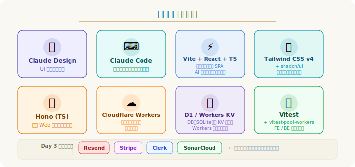
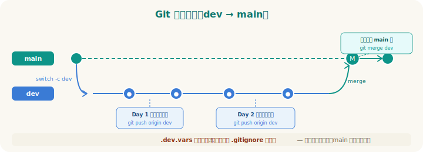
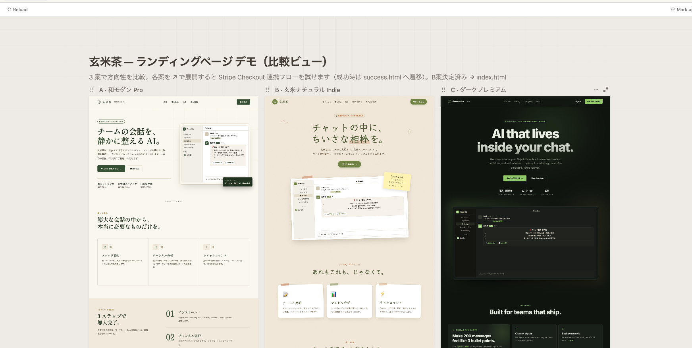
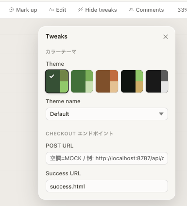
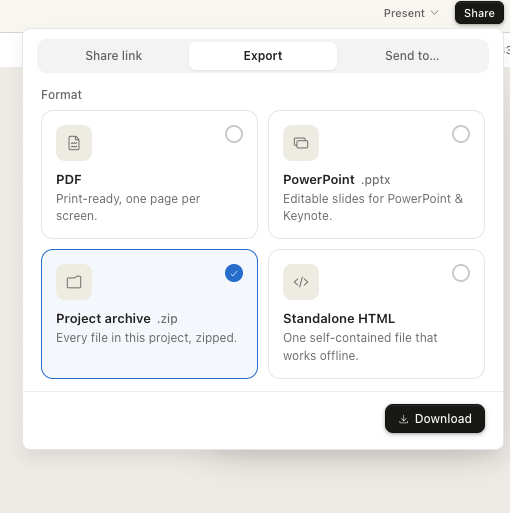
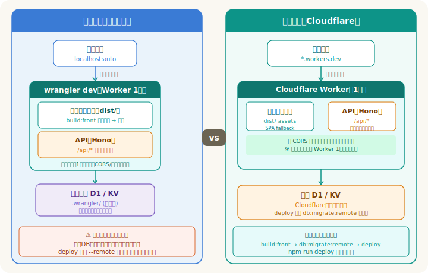
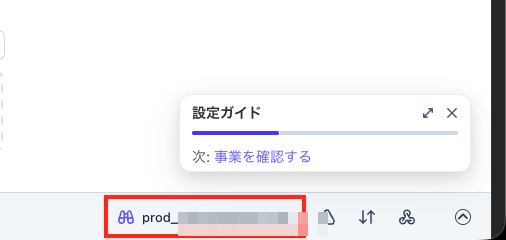
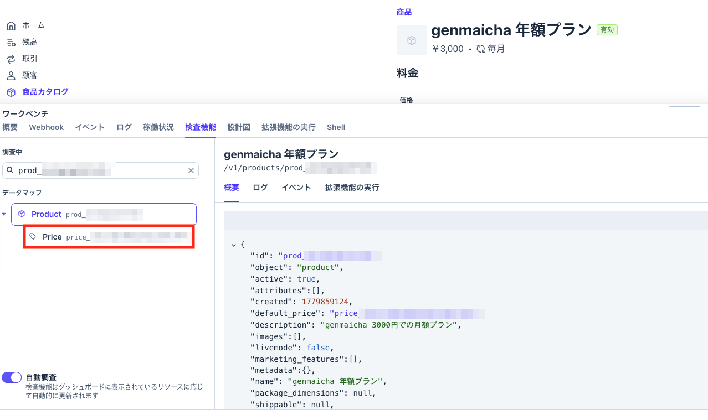
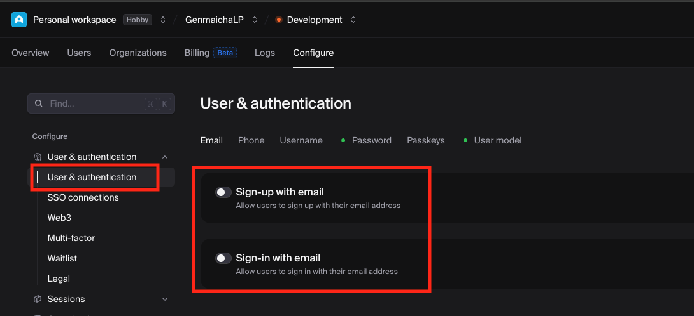

# 3Days ワークショップフロー: AI とつくる「自分の SaaS の MVP」

> **このドキュメントの考え方**
> 実装はほぼ Claude がやる。代わりに、
> **最初に「作るもの（タスク）」を丸ごと見せて**、進め方は各自が Claude と相談して決める。
> 資料側が固定するのは2つだけ:
> - **各タスクの「完了条件」**（これが満たせたらOK、という合格ライン）
> - **AI が確実に外す「落とし穴」**（Tailwind v4・wrangler の配信設定・D1/KV 作成・テスト設定 等）
>
> 後半の「流れ」（[1]〜[5]）は **[1]→[5] の順で進める**。粒度は各自で変えてよい。
> 困ったときに見る "詳細ガイド" の位置づけ。
>
> 前提: 参加者は完成品コードを渡されず **ゼロから自作**（再現では体験価値が薄れる）。
> **完成品も雛形も配布しない**（各自のプロジェクトは別物になる前提で進める）。
> コードの完成形は載せない。**題材は「各自が作りたい SaaS の MVP」**（事前に考えてきてもらう）。
> 資料に出てくる「玄米茶」はあくまで**説明用の共通サンプル**で、各自は自分の題材に読み替えて進める。

## 全体マップ

| Day | テーマ | 内容 |
|---|---|---|
| **Day 1** | つくる（前半） | 目的・技術紹介 / [1] デザイン / [2] フロント |
| **Day 2** | つなぐ・公開する | [3] バック / [4] 自動テスト / [5] デプロイ（Cloudflare Workers） |
| **Day 3** | 育てる | オプション課題 [6]〜[10] / ラップアップ・発表会 |

- **各日2時間 × 3日（計6時間）の短期集中型**。手を動かす時間が短いので、AI に大胆に任せてテンポよく進める
- Day 1〜2 が**全員共通の本編（必達）**。**Day 2 のデプロイ（公開）まで**を全員でやり切るのが目標
- Day 3 の**オプション課題は必須ではない**。興味・進捗に応じて選ぶ（やらない・1つだけ、も可）

---

## タイムテーブル目安（各日 2 時間 × 3 日 ＝ 計 6 時間）

> 全体像を先につかむために**最初に提示する**。時刻は「開始からの経過」で表記（実際の開始時刻に読み替える）。
> **時間が短いので分単位できつめ**。詰まったら粘らず AI に丸投げ＆次へ進むのがコツ。あくまで目安で各日内で調整してよい。

### Day 1: つくる（前半）— デザイン＋フロント

| 経過 | 内容 |
|---|---|
| 0:00–0:15 | オープニング: 目的・ゴール・3日間の全体像（**完走より一周体験が目的**と伝える） |
| 0:15–0:35 | 技術紹介（要点のみ）＋ 環境確認（最終チェックだけ・手短に） |
| 0:35–1:00 | [1] Claude Design（Anthropic 製 UI デザイン生成ツール。LP＝ランディングページを中心に3案 → 1つ選ぶ → 他ページを追加生成） |
| 1:00–1:55 | [2] フロント作成（デザイン zip を渡して全画面・モックで動かす） |
| 1:55–2:00 | クロージング: 次回予告・dev ブランチに git push できているか確認 |

### Day 2: つなぐ・公開する — バック＋テスト＋デプロイ（**ここがマスト**）

| 経過 | 内容 |
|---|---|
| 0:00–0:10 | 前回振り返り・キャッチアップ |
| 0:10–1:05 | [3] バック作成（API 実装 → フロント結合 → 配信一本化） |
| 1:05–1:35 | [4] 自動テスト（入力エラー・正常応答・未認証ブロックなど複数パターンをカバーするテストを最低1本ずつ） |
| 1:35–1:55 | [5] デプロイ（wrangler deploy + D1 マイグレーション → workers.dev URL で動作確認） 🎉 |
| 1:55–2:00 | クロージング: 到達確認・Day 3 課題選択（やる人だけ） |

### Day 3: 育てる（オプション課題 ＋ 発表会）

| 経過 | 内容 |
|---|---|
| 0:00–0:10 | オプション課題のガイダンス（必須ではない、と改めて伝える） |
| 0:10–1:30 | 自由作業: **Day 1〜2 の残タスクを続ける**、または**オプション課題**（[6]〜[10] から1つ選ぶ）——どちらでも可 |
| 1:30–2:00 | **最終発表会（1人3分）＋ ラップアップ・アンケート** |

---

## ワークショップの目的・ゴール（Day 1 冒頭）

### 前提知識（この3日間で前提とすること）

- **Claude Code を使ったことがある**（起動・依頼・承認/拒否の基本操作が分かる）
- **Git を用いた開発経験**がある（ブランチ・commit・push が一通りできる）
- **ソフトウェア開発の基本知識**（基本情報技術者試験程度）

> 「Claude Code そのものの入門」は本ワークショップの範囲外。
> [Claude Code セキュリティ対策参照](#s06)では入門ではなく **Claude Code を安全に使うためのセキュリティ対策**だけを扱う。

### 目的

- **Claude（Design / Code）を使った開発フローを3日間で一周する**
  - 「AI にどう頼むと良いものが出てくるか」の肌感をつかむ
- デザイン → フロント → バック → デプロイ → テスト → 機能拡張 という
  **実務に近い開発サイクル**を、駆け足ではなく**自分の手で納得しながら**回す

### ゴール（完了条件）

**必達（Day 1〜2 全員）**

- **[1] デザイン（Day 1）**
  - ゴール: LP の雰囲気・カラー・セクション構成の方向性を決める（ピクセルパーフェクトなカンプは作らない）
  - 完了条件: 使いたい機能すべてにたどり着ける画面・導線が揃い、デザインを zip で書き出せる
- **[2] フロント（Day 1）**
  - ゴール: デザイン通りの SPA（全画面）がローカル（`localhost:5173`）で動く（Day 1 終了時の到達点）
  - 完了条件: `localhost:5173` で表示崩れなし／React Router で4ページ遷移できる
- **[3] バック（Day 2）**
  - ゴール: フロントと API がつながり、ローカルで一通りの機能が動く
  - 完了条件（例・自分の題材に読み替え）:
    - トップページ（`/`）にアクセスして正常に表示される
    - `/mypage` が SPA として正常に表示される（ページ再読み込みしても 404 にならない）
    - `/api/me` に認証なしでアクセスすると「認証が必要」エラーが返る
    - `/api/contact` に必須項目を空にして送ると「入力内容が不正」エラーが返る
    - フロント画面から実際に操作して API と連動して動く
- **[4] 自動テスト（Day 2）**
  - ゴール: `npm test` で回帰検知ができる状態にする（デプロイ前にここを緑にする）
  - 完了条件:
    - 外部サービスに依存しない純粋な関数（キー生成・文字列マスク処理等）のテストが1つ以上
    - 正しい入力で API が成功レスポンスを返すことを確認するテスト（正常系）
    - 不正な入力で API が適切にエラーを返すことを確認するテスト（例: 必須項目が空のまま送信したとき、入力エラーとして弾かれる）
    - 未認証でログインが必要な API にアクセスしたとき、アクセスが拒否されることを確認するテスト
- **[5] デプロイ（Day 2）**
  - ゴール: 自分の URL（`https://<name>.workers.dev`）で世界に公開（Day 2 のフィナーレ）
  - 完了条件: 本番 URL で LP 表示／`/mypage` が 404 にならない

**任意（Day 3）**

- オプション課題 [6]〜[10] から興味のあるものを選んで実装し、最終発表会で発表する（やらない・1つだけ、も可）

> **必達は Day 2 のデプロイまで（[1]〜[5]）**。各日2時間と短いので、全員でここをやり切ることに集中する。
> **Day 3 のオプションは必須ではない**——やらない／1つだけ、も可。興味に応じて選ぶ。

### 題材: 各自が作りたい SaaS の MVP（**事前に考えてきてもらう**）

- **題材は各自が作りたい SaaS を持ち寄る**。「流れを体験するのが目的」なので題材は自由
- ただし3日間で一周できるよう、**下記の必須機能に相当するものを備えた MVP** に落とし込んでおく
  （事前周知で「どんな SaaS を作るか・必須機能をどう満たすか」を軽く考えてきてもらう）
- 資料中の例「玄米茶」は**説明用の共通サンプル**: ライセンスキー販売型のサブスク SaaS
  - ページ構成: LP（`/`）・問い合わせ（`/contact`）・マイページ（`/mypage`）・購入完了（`/success`）
  - 自分の題材では、このページ構成・機能を**自分のサービスに読み替える**
- 注意喚起: 3日間で一周するため、**Day 2 までは構成を盛りすぎない**（拡張は Day 3 のオプションで）

### 必須機能（作るものの最低ライン・Day 2 までに）

> **最初にこの完成像を提示する。**「何を作ればゴールか」が見えていないと迷うため。
> 題材は変えてよいが、**この5機能に相当するもの**は全員が作る。

| # | 機能 | 中身 | 対応ページ |
|---|---|---|---|
| 1 | **LP** | サービス紹介のランディングページ | `/` |
| 2 | **価格表示** | 料金プラン（月額／年額など）を見せる | `/`（または専用） |
| 3 | **お問い合わせフォーム** | 入力 → 送信 → 受付（`POST /api/contact`） | `/contact` |
| 4 | **マイページ** | ログインユーザーの情報・ライセンス表示 | `/mypage` |
| 5 | **ライセンスキーの配布** | 購入者にキーを発行・表示する。**Day 2 では自分たちで発行する簡易版**（手動 or 固定ロジック）でOK | `/success` 等 |

- 5 の「Stripe 購入 → Webhook で自動発行」は **Day 3 オプション [7]** に回す。
  Day 2 の core では**自前でキーを作って配る**ところまで（＝決済なしで配布の形だけ通す）。
- 認証（4 のログイン）も Day 2 は**モック認証（ログイン済みとして固定値を返す簡易実装）**でよい（本物の Clerk（ユーザー認証 SaaS）は Day 3 [8]）。

---

## 全体タスクマップ（最初にこれを丸ごと渡す）

> **使い方**: ワークショップ開始時にこの一覧を提示する。参加者は「この成果物を作る」という
> ゴールだけ持って、**進め方は Claude と相談して決める**。
> 各タスクで固定するのは **成果物 / 完了条件（合格ライン）/ AI が外す落とし穴** の3点だけ。
> [1]〜[10] の番号は後半の詳細ガイドの番号と対応する（＝この地図のどこを今やっているかが分かる）。

![ワークショップフロー図: Core（[1]デザイン→[2]フロント→[3]バック→[4]自動テスト→[5]デプロイ）と Option（[6]メール / [7]決済 / [8]ID連携 / [9]運用保守 / [10]セキュリティ）](img/workshop_flow_diagram.svg)

> 図は流れの全体像。各タスクの**成果物・完了条件・落とし穴**は下のカードを参照。

### Core（Day 1〜2・全員必達）

**[1] デザインの方向性を決める（Claude Design）**

Claude Design — Anthropic が提供する画面デザイン生成ツール。プロンプトで画面イメージを生成し、ZIP でエクスポートして Claude Code に渡せる。

- 成果物: 全画面分の方向性が決まった**デザイン（Claude Design の Project）**。zip でエクスポートして次タスクに渡せる
- 完了条件: 使いたい機能すべてにたどり着ける画面・導線が揃い、デザインを zip で書き出せる
- 落とし穴: ピクセル完璧を狙わない。見た目の細部は Claude Design 任せ／Tweaks で調整、指定するのは「中身（機能・売り）」

**[2] フロント（LP・価格表示・各ページ）**
- 成果物: `/`(LP＋価格) `/contact` `/mypage` `/success` が SPA で動く（Vite + React + TS + Tailwind v4）
- 完了条件: `localhost:5173` で表示崩れなし／React Router で4ページ遷移できる
- 落とし穴: **Tailwind v4 は Vite プラグイン方式**（`@tailwindcss/vite`・`@import "tailwindcss"`）。v3 流儀だと効かない

**[3] バック（API＋ライセンス発行）**
- 成果物: `POST /api/contact`／`GET /api/me`（モック認証）／`POST /api/verify-license`／**購入者へキーを自前発行**
- 完了条件（例・自分の題材に読み替え）:
  - トップページ（`/`）にアクセスして正常に表示される
  - `/mypage` が SPA として正常に表示される（ページ再読み込みしても 404 にならない）
  - `/api/me` に認証なしでアクセスすると「認証が必要」エラーが返る
  - `/api/contact` に必須項目を空にして送ると「入力内容が不正」エラーが返る
  - フロント画面から実際に操作して API と連動して動く
- 落とし穴: ① **D1/KV を先に `wrangler d1 create <db-name>` / `wrangler kv namespace create <name>` して id を `wrangler.toml` に貼る** ② `[assets]` は `dist` ＋ `not_found_handling="single-page-application"` ③ 秘密は `.dev.vars`（.gitignore に追加し、さらに .claude/settings.json の permissions.deny にも追加して Claude Code に読ませない設定も忘れずに。[Claude Code セキュリティ対策参照](#s06)）

**[4] 自動テスト**
- 成果物: `npm test` がグリーン
- 完了条件:
  - 外部サービスに依存しない純粋な関数（キー生成・文字列マスク処理等）のテストが1つ以上
  - 正しい入力で API が成功レスポンスを返すことを確認するテスト（正常系）
  - 不正な入力で API が適切にエラーを返すことを確認するテスト（例: 必須項目が空のまま送信したとき、入力エラーとして弾かれる）
  - 未認証でログインが必要な API にアクセスしたとき、アクセスが拒否されることを確認するテスト
- 落とし穴: **`@cloudflare/vitest-pool-workers` の `defineWorkersConfig`**（素の vitest 設定では動かない）／外部 fetch は全部モック

**[5] デプロイ（公開）**
- 成果物: `https://<name>.workers.dev` で公開
- 完了条件: 本番 URL で LP 表示／`/mypage` が 404 にならない
- 落とし穴: **リモート D1 マイグレーション忘れ（deploy 前に npm run db:migrate:remote を必ず実行）**／ビルド失敗で deploy が止まる

### Option（Day 3・選択式・必須ではない）

| # | タスク | 成果物 / 完了条件 |
|---|---|---|
| **[6]** | メール（Resend） | 問い合わせ受付メール・ライセンス送付メールを自分宛に送れる。短時間に連続送信したときにレート制限（送りすぎ拒否）が正しく働く |
| **[7]** | 決済（Stripe） | Stripe の決済画面（Checkout）を経て、購入完了時に Webhook 経由でライセンスキーが自動発行される。テスト用カードで試してマイページにキーが表示されること。落とし穴: Webhook の受信先 URL 登録忘れ（ローカルは stripe listen、本番は Stripe ダッシュボードに登録） |
| **[8]** | ID 連携（Clerk） | Clerk（ユーザー認証サービス）でログイン機能を本物に差し替える。未ログイン状態でマイページ（`/mypage`）にアクセスできない・マイページ取得 API（`/api/me`）がログイン必須になっている |
| **[9]** | 運用保守 | `wrangler tail` でデプロイ済みアプリのログをリアルタイム確認できる。KV（Cloudflare のキーバリューストア）を使った IP レート制限を実装し、短時間に連続アクセスしたとき送りすぎ拒否が返ることをテストで証明できる |
| **[10]** | セキュリティ | 認証の抜け穴（未ログインで保護 API にアクセスできないか）・IDOR（Insecure Direct Object Reference：権限のない他人のデータを横断参照できてしまう脆弱性）・API レスポンスへの秘密情報の混入を点検。Claude Code のセキュリティレビューと SonarQube（静的解析ツール）を併用。問題を最低1つ修正し、回帰テストを追加 |

> 以降の [1]〜[5] は、上のタスクを**こなすときの推奨フロー＋落とし穴の詳細**。
> 詰まったとき・確認したいときに開く詳細ガイド。Day 3 の [6]〜[10] も同様の形式で後続セクションに詳細ガイドが続く。

---

## 使う技術の紹介（Day 1 冒頭）

> 資料では1技術1スライド程度。「なぜこれを選ぶか」を一言添える。
> **各日2時間と短いので、技術紹介は要点のみ・手短に**（深掘りは各自で。Day 1 は早めに手を動かし始める）。



| カテゴリ | 技術 | 選定理由（一言） |
|---|---|---|
| AI（デザイン） | Claude Design | プロンプトから UI デザインを生成 |
| AI（実装） | Claude Code | ターミナルで動くコーディングエージェント |
| フロント | Vite + React + TypeScript | デファクト。AI が一番得意なスタック |
| スタイル | Tailwind CSS v4 + shadcn/ui | デザインの再現がしやすい |
| バック | Hono (TypeScript) | 軽量・Workers と相性抜群 |
| 実行基盤 | Cloudflare Workers | 無料枠で本番公開まで行ける |
| DB / KV | Cloudflare D1 / KV | Workers にビルトイン。セットアップ最小 |
| テスト | Vitest（+ vitest-pool-workers） | フロント・バックで統一できる |
| （Day 3） | Resend / Stripe / Clerk / SonarQube | オプション課題で登場、と予告だけ |

> **Claude Design のアクセス方法**: **claude.ai にブラウザでログインして使う**デザイン生成機能。
> Claude Code と同じ Claude アカウントで利用できる（追加のインストールは不要）。
> アカウント準備の詳細は下記「事前準備」セクションを参照。

### 事前準備（参加者に事前周知）

> **電話番号が必要なツールは無し**（参加者に安心材料として伝えてよい）。

**⓪ 考えてくる**

- **自分が作りたい SaaS の MVP**をざっくり考えてくる（どんなサービスか・必須機能をどう満たすか）。
  迷う人は「玄米茶」をそのまま自分の題材にしてもよい

**① 事前に作っておくアカウント（全員必須）**

- **GitHub** — リポジトリ取得・SonarQube のログインにも使う（当日のアカウント作成は時間を食うので必ず事前に）
- **Cloudflare** — デプロイ先 [5] は**全員必達**なので事前に作っておく（アカウント作成は無料・電話番号不要）
  - 環境設定: `npx wrangler login` でブラウザ認証 → `npx wrangler whoami` で**想定アカウントか確認**
    （wrangler はプロジェクトの依存に含まれるので別途インストール不要。事前準備時点ではまだプロジェクトが無い場合は `npx wrangler login` で実行できます。複数アカウント持ちは取り違えに注意）

**② 事前にインストールしておくツール**

- **Claude Code CLI** — 本ワークショップの主役。`npm install -g @anthropic-ai/claude-code` でインストール。起動時にサインインが要るので、**インストール＋ログインまで**済ませておく
  - 余裕があれば **security-guidance プラグイン**（`/plugin install security-guidance@claude-plugins-official` ※ コマンドが失敗した場合はスキップ可）も入れておくと、Day 1 のコーディングから AI のコードを自動でセキュリティ点検してくれる（詳細は[Claude Code セキュリティ対策参照](#s06)参照）。`python3` が PATH に通っていることが前提
- **Stripe CLI** — **[7] 決済をやる場合のみ必要。インストールのみ事前に済ませる。アカウントは当日取得後に `stripe login` でログイン。** インストール: `brew install stripe/stripe-cli/stripe` または https://docs.stripe.com/stripe-cli 参照
- （エンジニア前提のベースライン）**Node.js 18+（できれば 20+ LTS）** / **git**

**③ 当日それぞれ取得するアカウント（無料・電話番号不要）**

- **Resend**（トランザクションメール送信サービス）— メール課題 [6] で使用
- **Stripe** — 決済課題 [7]
- **Clerk**（ユーザー認証・ログイン機能 SaaS）— 認証課題 [8] で使用
- **SonarQube（SonarCloud）** — セキュリティ課題 [10]。**GitHub アカウントでログイン**できる

> Resend / Stripe / Clerk / SonarQube は Day 3 のオプション課題用。**やる課題の分だけ**当日取得すればよい。ただし Stripe CLI のインストールだけは事前に済ませておくこと（[7] 決済をやる場合。② 参照）。

### 環境確認タイム（Day 1 で必ず取る）

> **時間短縮のため、ツール導入・各アカウント作成・`wrangler login` は事前準備で済ませておく**。
> ここでは「ちゃんと動くか」の最終確認だけを手短に（詰まっている人の救済を優先）。長引かせない。

- `node -v`（**18 以上、できれば 20+ LTS**）/ `git --version` / `claude --version` を全員で確認
- **Claude Code がログイン済み**で起動できるか（`claude` を叩いて会話できる状態か）
- **Claude Design** に claude.ai でアクセスできるか（ブラウザでログイン確認）
- GitHub からリポジトリを clone できるか
- Cloudflare に `wrangler login` 済みで、`wrangler whoami` が**想定アカウント**を返すか（複数アカウント持ちは特に注意）
- ここで詰まる人を救済してから先へ進む（3日間の安定運行のための投資）
- 補足: wrangler 実行時に出る `out-of-date` 警告は**無視して進めてOK**（動作に支障なし）

---

## Claude Code のセキュリティ対策

> Claude Code の基本操作（起動・依頼・承認/拒否）は前提知識（0節）として扱う。
> ここでは **AI に開発させるうえで最初に固めておきたいセキュリティ設定**だけを揃える。
> どちらも**事前準備〜Day 1 冒頭に1回**やっておけば、以降のコーディングがずっと安全になる。

> 大前提（3日間ずっと効く）: **秘密情報（API キー・トークン）は Claude への指示にも会話にも貼らない**。
> 後述の `.dev.vars`（Cloudflare Workers のローカル秘密情報ファイル、後の [3] バックで作成）に入れて参照させる。AI が書いたコードも**読まずに承認しない**。

### 最初に1回やる: 秘密を Claude に読ませない設定

> よくある勘違い: **「`.claudeignore` を作る」→ Claude Code に `.claudeignore` は無い**。
> 正しくは `.claude/settings.json` の **`permissions.deny`** で「読み取り禁止」を宣言する。

プロジェクト直下に `.claude/settings.json` を作り、秘密ファイルへの `Read` を拒否しておく（`.claude/` ディレクトリがなければ `mkdir -p .claude` で作成。既存ファイルがある場合は `permissions` キーをマージ）:

```json
{
  "respectGitignore": true,
  "permissions": {
    "deny": [
      "Read(./.dev.vars)",
      "Read(./**/.dev.vars)",
      "Read(./.env)",
      "Read(./.env.*)",
      "Read(./secrets/**)"
    ]
  }
}
```

- `deny` は最優先。これで万一「`.dev.vars` 読んで」と頼んでも **Claude は読めない＝事故防止**
- `respectGitignore`（既定 `true`）により、`.gitignore` 済みの `node_modules` / `dist` は
  `@` のファイル選択に出てこない＝**コンテキストも汚れにくい**
- 秘密ファイル（`.dev.vars`）が実際に登場するのは [3] バックから。**設定だけ先に置いておく**のがコツ

### 最初に1回やる: security-guidance を入れておく（AI のコードを自動でセキュリティ点検）

> **security-guidance とは**: Claude が**生成したコードを自動でセキュリティレビューしてくれる
> このワークショップで使用するプラグイン**（`security-guidance`）。インジェクション・XSS・SSRF・ハードコードされた秘密・
> IDOR・認可バイパス・安全でないデシリアライズ・パストラバーサルなど **25 種類以上の脆弱性クラス**を見てくれる。
> 「AI が書いたコードを AI が点検する」を**バックグラウンドで勝手にやってくれる**のがポイント。

3 層構造で動く（参加者は中身を覚えなくてよい。「勝手に守ってくれる」と理解できれば十分）:

1. **パターン警告** — `Edit`/`Write` のたびに、既知の危険パターン（生の `innerHTML`・秘密のハードコード等）を
   正規表現で**その場で警告**
2. **差分の LLM レビュー** — Claude が応答を返す直前に**変更差分を別の LLM が点検**し、
   重大な指摘を Claude にフィードバック → **こちらが見る前に直してくれる**
3. **コミット時のエージェントレビュー** — `git commit` のとき、関連ファイルを `Read`/`Grep` でたどって
   **複数ファイルにまたがる脆弱性**（IDOR・認可バイパス・横断的な SSRF 等）まで検出

これで**何ができるようになるか**:

- AI が書いたコードの脆弱性を、**書いた直後・コミット時に自動で気づける**（人間のレビューの取りこぼしを補う）
- 玄米茶（本ワークショップで構築するサンプルアプリ）では特に [3] バックの `GET /api/me`（モック認証）や `verify-license`、Day 3 [7] の決済まわりで
  **IDOR・認可バイパス**が出やすい。security-guidance がここを継続的に見張ってくれる
- Day 3 [10] セキュリティ課題の**下地**になる（手動の `/security-review` は「狙って点検する」、
  security-guidance は「常時バックグラウンドで点検する」——役割が違うので**併用が効く**）

導入（事前準備の段階で1回やっておくと、Day 1 のコーディングから恩恵を受けられる）:

```
/plugin install security-guidance@claude-plugins-official
```

※ コマンドが見つからない場合はスキップして先へ進んでください。Day 1〜2 の本編には影響しません。

- インストール後、`/plugin list` で `security-guidance` がリストに表示されることを確認する
- **前提**: Claude Code CLI が新しめ（`claude --version` で確認）／`python3` が PATH に通っていること（理由: プラグインが内部で Python スクリプトを使用するため）
- うるさく感じたら環境変数 `SECURITY_GUIDANCE_DISABLE=1` で全体オフにできる（**キルスイッチ**）
- プロジェクト独自のルールは `<project>/.claude/claude-security-guidance.md` に書いて差分レビューに効かせられる（任意）

---

## Git の進め方（dev → main）

前提: GitHub でリポジトリを新規作成し、ローカルに clone してから以下を実施する。

> リポジトリの置き場所は各自で決めてよいが、**SonarQube に解析させる単位を分けたいので
> 「専用の別リポジトリ」を用意するのが推奨**。

- 最初に **`dev` ブランチを切り、作業はすべて `dev`** で進める（空リポジトリの場合は README 等を main に最初の commit で push してから dev を切る）
- 区切りのいいところで**こまめに commit / push**（環境が壊れても作業を失わないための保険）
- **各日のクロージングで「dev に push 済みか」を必ず確認**（翌日のキャッチアップが楽になる）
- 完成したら **`dev` → `main` にマージ**（`main` ＝ 公開・解析対象の安定版）



```bash
git switch -c dev      # 最初に dev を切る
git push -u origin dev  # 初回 push は -u で upstream を設定
# … dev で実装・こまめに commit / push …
git switch main
git merge dev          # 完成したら main へ
git push origin main   # main もリモートへ push
```

- SonarQube は `main`（または PR）を解析する想定（[10] セキュリティで使う）
- **秘密ファイル（`.dev.vars` 等）は `.gitignore` で必ず除外**してコミットしない

---

# 詳細ガイド（推奨フロー）

> ここから先（[1]〜[5]）は **「全体タスクマップ」をこなすための推奨手順と落とし穴の詳細**。
> **順番は [1]→[5] の通りに進める**。粒度は各自で変えてよい。タイムテーブルや進行台本としても使える。

# Day 1: つくる（前半）

## [1] Claude Design でサイトデザイン作成

**ゴール**: LP および主要画面（マイページ・問い合わせ・サクセス）の雰囲気・カラー・セクション構成の方向性を決める（ピクセルパーフェクトなカンプは作らない）

> **アクセス**: Claude Design は **claude.ai にブラウザでログイン**して使う（Claude Code と同じアカウント）。左サイドバーの「Explore Claude」→「Claude Design」を選ぶか、https://claude.ai/design に直接アクセス。

> **なぜ Design.md を作らないのか**
> UX デザインの一般的なフローは「Design.md で構造・要件を言語化 → Claude Design でビジュアライズ」だが、今回は省略している。理由は、LP・問い合わせ・マイページ・購入完了という**ごく一般的な SaaS の画面構成**であり、Claude Design 自体がそのパターンを熟知しているため、事前に言語化しなくても十分なアウトプットが出るから。Design.md が効くのは**独自のユーザーフロー・複雑な要件・チームでの認識合わせ**が必要な場合。今回はいずれも該当しないので、サービスの内容を直接伝えるだけで十分。

### 流れ

1. Claude Design に「**何を・誰に向けて作るか／何を売るか／欲しい機能**」を伝えてデザインを生成
   - Claude Design は、トーンや配色など方向性を決める質問を**自分から投げ返してくれる**。だから最初から「和モダンで緑系で…」と細かく指定する必要はない。むしろ**サービスの中身（何のサービスか・売りたいもの・載せたい機能）**を伝える方が効く
   - 例:「日本茶サブスク SaaS『玄米茶』の LP。月額／年額プランを売りたい。特徴・料金・FAQ・問い合わせへの導線がほしい」程度でOK
   - **1回のプロンプトでデザイン案を3つ**出してくれる
   - **まず LP だけを生成して1案選んでから、他ページ（/contact /mypage /success）を追加生成する**（時間短縮のコツ。全ページを一度に指定しないこと。詳細は下記手順4参照）
2. **出てきた3案を見比べて1つ選ぶ**
   - 最初の1案でなんとなく進めず、**3案を見比べてから決める**（選択肢を見てから選ぶのが AI 活用のコツ）


   

3. **トーン・配色・アクセントは画面上部タブの「Tweaks」から後で調整できる**（プロンプトに盛り込まなくても、触って変えられる）

   
4. **時間短縮のコツ: 最初は他ページを盛らず LP だけで3案 → 1つ選ぶ → そのあとに他ページ（マイページ・問い合わせ・サクセス）を追加生成する**
   - 選んだデザインシステムが流用されるので、追加ページの生成は速い
5. 仕上がったデザイン（UX 案を含む）は **Claude Design の Project を zip でエクスポート**しておく
   - 操作: 画面右上の「Share」ボタン → 「Project archive (.zip)」を選んでダウンロードする。
   - → これを [2] でそのまま Claude Code に渡す。**色やフォントを別途テキストで言語化する必要はない**（デザインそのものを渡す方が早くて正確）

   

### ポイント（資料で強調すること）

- **「それっぽいものが作れた」で十分**。完璧より方向性の確定が目的
- **指定するのは「中身（機能・売り）」**。見た目の細部は Claude Design に任せる／後から Tweaks で触る
- **いきなり1案に飛びつかない**。デフォで出る3案を見比べて選ぶ
- **言語化テキストを書くより、デザイン Project（zip）を丸ごと渡す**のが [2] への一番の橋渡し

### ✅ 完了の定義（これが満たせたら [2] へ）

- 必要な**全画面**（LP・マイページ・問い合わせ・サクセス相当）の方向性が決まっている
- **「使いたい機能すべてにたどり着ける」導線・要素**（ページ・ボタン・リンク）が画面上に揃っている
- デザインを **zip でエクスポートでき、[2] にそのまま渡せる**状態になっている

---

## [2] Claude Code でフロント作成

**ゴール**: デザイン通りの SPA（全画面）がローカル（`localhost:5173`）で動く（Day 1 終了時の到達点）

> **大事な前提：フロントとバックは「別プロジェクト」として分ける**
> フロントは**フロント専用のディレクトリ**（例 `genmaicha_front/`）で作る。明日のバックは
> **別ディレクトリ**（例 `genmaicha_back/`）で作る。役割（画面 / API・DB）もビルド・デプロイの単位も
> 違うから分ける——これは実務でも基本の考え方。
> （最終的に配信は Worker 一本にまとめるが、**ソースは分けたまま**：[3]手順6）

### 流れ

1. フロント専用ディレクトリにプロジェクト雛形を Claude Code に作らせる
   - ターミナルで `mkdir genmaicha_front && cd genmaicha_front` してから `claude` コマンドで Claude Code を起動する
   - 「Vite + React + TS + Tailwind v4 + shadcn/ui で SPA を作って。ページは `/` `/contact` `/mypage` `/success`、React Router で」
2. [1] でエクスポートした **Claude Design の Project（zip）を渡して**（**zip を事前に展開し**、展開したフォルダを Claude Code に渡す（例: 「このデザインで実装して」と伝え、展開先フォルダのパスを添える）。※ Claude Code は zip を自動展開しないため、先に手動で展開してください）「このデザインで実装して」と頼む
   - 言語化テキストではなく**デザインそのもの**を渡す。色・フォント・余白の指定はそこから AI が拾う
3. **LP だけでなく全画面（`/contact` `/mypage` `/success`）まで実装させる**
   - この段階では **API がまだ無いので、各画面はモックデータで動かす**（例: マイページは
     ダミーのライセンス情報を表示）。明日 [3] でこのモックを実 API 呼び出しに差し替える
4. `npm run dev` で確認 → HMR で「AI に直させる → 即見る」を会話で繰り返す

> 共通パーツ（ナビ・フッター）の切り出しは**AI が自然にやることが多い**ので、こちらから細かく指示しなくてよい。気になったら「共通化して」と頼む程度でOK。

### ポイント

- **API はまだ無い**。この段階では**モックデータで画面が動く**状態を作る、と割り切る
- shadcn/ui の追加は `npx shadcn@latest add <component>`（Claude Code が勝手にやるのを観察するのも面白い）
- HMR（保存即反映）で「AI に直させる → 即見る」のループを体感してもらう

### ⚠️ ハマりどころ: Tailwind CSS v4

v4 は v3 から設定方法が**大きく変わっている**。AI が古い v3 の流儀で書くと動かないので注意：

- **PostCSS / `tailwind.config.js` は使わない**。代わりに **Vite プラグイン方式**
  - `vite.config.ts` に `import tailwindcss from "@tailwindcss/vite"` を入れ、`plugins: [react(), tailwindcss()]`
  - CSS の先頭は `@import "tailwindcss";`（v3 の `@tailwind base/components/utilities` ではない）
- テーマ（色）は CSS 変数 + `@theme` で定義する。`src/index.css` の例:
  ```css
  @import "tailwindcss";
  @theme {
    --color-bg: #faf8f2;
    --color-accent: #5a7a4f;   /* [1] で決めた色をここに */
  }
  ```
- 「Tailwind が効かない」と感じたら、まずこの v3/v4 混在を疑う

`vite.config.ts` の要点（これも Claude に作らせてよい）:

> vite.config.ts の `proxy` 設定は Day 2 の [3] で使います。Day 1 では `plugins` と `resolve.alias` だけあれば十分で、プロキシは [3] のタイミングで追記してください。

```ts
import { defineConfig } from "vite"
import react from "@vitejs/plugin-react"
import tailwindcss from "@tailwindcss/vite"
import path from "node:path"

export default defineConfig({
  plugins: [react(), tailwindcss()],
  resolve: { alias: { "@": path.resolve(__dirname, "./src") } },
  // server: { proxy: ... }  // ← Day 2 の [3] でここに追記
})
```

> **なぜプロキシするのか**: 開発モードはフロント(:5173)とAPI(:8787)がオリジン違いになり、
> 直接 fetch すると **CORS で弾かれる**。`/api` を :8787 に**プロキシ＝同一オリジン扱い**にして回避する。
> 本番は Worker 一本で配信する（[3]手順6）ので最初から同一オリジン＝CORS の悩みが消える。

### ✅ 完了の定義（Day 1 の到達点）

- `npm run dev` で `http://localhost:5173` を開くと **LP が崩れずに表示される**（Tailwind が効いている）
- `/` `/contact` `/mypage` `/success` の**全画面が実装され**、React Router で**遷移できる**（データは API 前なのでモック）
- デザイン [1] の方向性が画面に反映されている

### Day 1 クロージング

- 各自の LP をスクリーンで何人かに見せてもらう（5分）
- 「明日はこれに API をつないで世界に公開します」と予告
- push 前に `genmaicha_front/.gitignore` が存在し、`node_modules` と `dist` が除外されているか確認する
- **dev ブランチに push できているか全員で確認**（`git add . && git commit -m 'day1 front' && git push origin dev`）。リポジトリをまだ作っていない人は先に ① GitHub で空リポジトリを作成 → ② `git init && git add README.md && git commit -m 'init' && git push origin main` → ③ `git switch -c dev && git push -u origin dev` の順で進める（詳細は [Git の進め方](#git-の進め方dev--main) 参照）。（※完成品・雛形は配布しない方針なので、各自の保全が頼り）

---

# Day 2: つなぐ・公開する

## [3] Claude Code でバック作成

**ゴール**: フロントと API がつながり、ローカルで一通りの機能が動く

> **大事な前提：バックはフロントとは別ディレクトリ（別プロジェクト）で作る**
> [2] のフロント（`genmaicha_front/`）とは別に、バックは `genmaicha_back/` という**別ディレクトリ**で作る。
> 「画面を出す係（フロント）」と「API・DB の係（バック）」を分けるのが基本。
> 最終的に配信は Worker 一本にまとめる（手順6）が、**ソースは分けたまま**。

### 事前に: Cloudflare にログインする

バックはこの先 Cloudflare 上の資源（DB など）を作る・触るので、**最初に CLI でログイン**しておく:

```bash
wrangler login     # ブラウザが開く → Cloudflare 上で「許可」する
wrangler whoami    # ログインできたか／想定アカウントかを確認
```

- 会社用・個人用など**複数アカウントを持っている人は `whoami` で取り違えていないか必ず確認**（別アカウントに資源を作る事故を防ぐ）
- グローバルに wrangler が入っていない場合は `npx wrangler login` を使う。または手順1のプロジェクト作成後に再度 `wrangler login` してもよい

### 流れ

1. Hono + Cloudflare Workers のプロジェクトを Claude Code に作らせる（`genmaicha_back/`）
   - 併せて **`.gitignore` も作らせる**（`node_modules` / `dist` / `.dev.vars` などを除外）。秘密ファイルを誤ってコミットしないための保険

2. **クラウド資源（DB・KV）を作って `wrangler.toml` に登録する**
   - **何をしている？** → アプリが使う「データの保存場所」を Cloudflare 側に用意している
     - **D1** … Cloudflare の SQLite データベース。問い合わせ・ライセンスなどを保存する
     - **KV** … キー：値の簡易ストア。レート制限のカウンタなどに使う

     ```bash
     cd genmaicha_back
     wrangler d1 create genmaicha-demo     # → database_id が出力される
     wrangler kv namespace create KV       # → id が出力される
     ```

   - 出力された id は **`wrangler.toml`（Worker の設定ファイル）に書く**。このファイル自体は Claude Code に作らせてよい
     最小サンプル:
     ```toml
     [[d1_databases]]
     binding      = "DB"
     database_name = "genmaicha-demo"
     database_id  = "<ここに出力された database_id を貼る>"

     [[kv_namespaces]]
     binding = "KV"
     id      = "<ここに出力された id を貼る>"
     ```
   - 大事なのは中身を丸暗記することではなく、**「アプリと、いま作った DB / KV / フロント配信設定を結びつける設定ファイル」だと理解すること**。特に効いてくるのは2つ（意味だけ押さえる）:
     - フロントの `dist/` を配信する設定（`[assets]`）
     - 未知パスを `index.html` に返す **SPA フォールバック**設定（無いと `/mypage` 直アクセスが 404）

   > **なぜ「先に」作るのか（＝ローカルでは使わないのに）**
   > ローカル開発（`wrangler dev` / `npm run dev`）は**手元のエミュレーション**（`.wrangler/` 内のローカル D1・KV）で動き、**この時点ではクラウドの D1/KV には一切触らない**。
   > それでも先に作るのは、**`wrangler.toml` に実在の `database_id` / KV の `id` が必要**で、これが無いと **本番側（[5] の `db:migrate:remote` と `deploy`）が失敗する**から。
   > ローカルの `db:migrate:local` は手元だけで完結するので、クラウド資源が無くても動く（＝**ローカルと本番はデータが別物**。詳細は手順4）。

3. **API をまとめて実装させる**
   - 必要な機能を**日本語でまとめて伝え、Claude にいっぺんに実装させてよい**（Opus なら1本ずつ刻む必要はない）。API の形（パス・入出力）の設計も AI に任せてよい
   - この題材で要る機能（例。日本語で伝える）:
     - 問い合わせを受け付けて保存する（同一 IP からの連投はクールダウンして弾く → [9] で深掘り）
     - ログイン中ユーザーの情報を返す。**ただしこの場面（Day 2）はモック認証でよい**（リクエストヘッダのメールを信頼して返すだけ（使うヘッダ名例: X-User-Email。フロントと一致させること）。本物の Clerk（ユーザー認証 SaaS）は Day 3 [8]）。あとで認証だけ差し替えられる作りにしておくと教材として良い
     - ライセンスキーを検証する
   - **保存するデータの中身だけ先に決めておく**と AI が迷わない（例: 問い合わせ＝名前／メール／本文、ライセンス＝キー／メール／プラン／発行日時）。**テーブル定義（SQL）は AI に書かせる**（`migrations/0001_init.sql` のような wrangler が認識するパスに置く必要がある。Claude Code に「`migrations/` ディレクトリに SQL ファイルを作って」と指示する）

4. **ローカル用の DB を用意する（マイグレーション）**

   > ここで一度 **「ローカル」と「クラウド（本番）」の違い**を押さえる。ここが曖昧だと「今どっちを触ってる？」になりやすい:
   > - 開発中は**手元の PC の中だけにあるローカルの D1**（`--local`）を使う。壊しても本番に影響しない
   > - 本番（Cloudflare 上の D1）は**別物**で、[5] デプロイのときに `--remote` で改めてマイグレーションする
   > - つまり手順2で「箱（DB）は Cloudflare に作った」が、**中のテーブルはローカル用・本番用で別々に作る**

   | タイミング | コマンド | 対象 |
   |---|---|---|
   | API 実装中（今ここ） | `npm run db:migrate:local` | 手元の D1（ローカル） |
   | デプロイ直前（[5]） | `npm run db:migrate:remote` | Cloudflare の D1（本番） |

   

   ```bash
   npm run db:migrate:local    # 手元(ローカル)の D1 にテーブルを作る
   ```

   失敗した場合は `migrations/` ディレクトリの有無・SQL ファイルの存在を確認。`wrangler d1 migrations list DB --local` でも確認できる。

   > ※ `DB` は `wrangler.toml` の `[[d1_databases]]` `binding = "DB"` と一致している必要がある（コマンド引数に使うのはバインディング名で、データベース名の `genmaicha-demo` とは別物）

5. （前提: `genmaicha_back` で `npm run dev` を起動した状態で実施する）フロントの**モック表示を、実 API 呼び出しに差し替え**させる。具体的には、**フロントの fetch/axios 呼び出し部分（[2] で作ったモックデータ返却箇所）を `/api/…` への実 HTTP リクエストに置き換える**。Claude Code への指示例: 「モックを実 API 呼び出しに変えて。バックは localhost:8787」。差し替え後はモード B（フロント:5173 + バック:8787）でブラウザ確認する。ブラウザコンソールに CORS エラーが出たら `vite.config.ts` のプロキシ設定を確認（[2] 手順参照）。

6. **配信を一本化**（本番の形にする）
   - フロントを `dist/` にビルドし、Worker から配信する（未知パスは SPA フォールバックで `index.html`）
   - これで**フロントと API が同一オリジン**になる＝本番では CORS 設定が要らない
   - ソースは分けたまま、**配信だけ1つの Worker にまとまる**イメージ
   - `wrangler.toml` に `[assets]` セクションを追加し `directory = '../genmaicha_front/dist'` を指定する（Claude Code に「wrangler.toml に [assets] を追加してフロントの dist を配信させて」と頼む）。ビルド→デプロイは `npm run deploy` 一発で完結する

### 必要な npm scripts（よく使う操作に名前を付けておく）

`wrangler …` の長いコマンドを毎回打つ代わりに、**よく使う操作を `package.json` の script にまとめておく**と楽。
これも Claude Code が作るので、下のような操作が**一通り揃っているかだけ見ておく**（足りなければ「この操作の script を足して」と頼む）：

| script | 中身 | 用途 |
|---|---|---|
| `dev` | `wrangler dev` | ローカル起動（:8787） |
| `build:front` | `npm --prefix ../genmaicha_front run build` | フロントを dist/ にビルド |
| `db:migrate:local` | `wrangler d1 migrations apply DB --local` | ローカル D1 にマイグレーション |
| `db:migrate:remote` | `wrangler d1 migrations apply DB --remote` | 本番 D1 にマイグレーション（[5]で使う） |
| `deploy` | `npm run build:front && wrangler deploy` | ビルド→デプロイ一発（[5]で使う） |
| `test` | `vitest run` | テスト（[4]で使う） |

### ローカルでの動かし方（2モード）

```bash
# A. 本番と同じ形（Worker 一本: :8787）— ビルドしたフロントを Worker が配信
cd genmaicha_back && npm run build:front && npm run dev

# B. フロント開発モード（HMR）— フロント:5173 と バック:8787 を「両方」起動
cd genmaicha_back  && npm run dev    # ターミナル1（API の実体: :8787）
cd genmaicha_front && npm run dev    # ターミナル2（画面の高速プレビュー: :5173）
```

> **B でバックも起動するのは矛盾ではない**。:5173 はあくまで**画面を速く確認するためのプレビュー**で、
> そこから叩く API の実体は :8787 のバック。だから両方を立て、:5173 の `/api` を :8787 に
> プロキシして同一オリジン扱いにする（[2] の `vite.config.ts` 参照）。
> 「画面を直しながら確認したい」ときが B、「本番と同じ挙動を見たい」ときが A。

### ポイント

- 認証（Clerk）・決済（Stripe）・メール（Resend）は**Day 2 では深追いしない**
  → Day 3 のオプション課題 [6][7][8] で扱う、と予告しておく
- **Day 2 のログイン周りはモック認証でよい**（手順3）。本物の Clerk を入れるとき
  **そこだけ差し替えればいい作り**にしておくと、差し替えポイントが明確で教材としても良い
- **秘密情報の扱い**はここで一度釘を刺す:
  - `.dev.vars`（ローカル）/ `wrangler secret put`（本番）を使う
  - キーをコードにハードコードしない・AI への指示にも貼らない
- **Day 2 core で必要な環境変数は最小限**。Stripe / Clerk / Resend のキーは**無くても起動する**:
  - 必要なのは `ORIGIN` / `FRONTEND_ORIGIN`（ローカルは `http://localhost:8787`）と、問い合わせ用の `EMAIL_*` / `CONTACT_TO` 程度（Resend を使わない場合は未設定でよい。メール送信をモックするか後回しにする）
  - これらは `wrangler.toml` の `[vars]`、ローカル上書きは `.dev.vars` に書く（`.dev.vars` は `.gitignore` 済みであることを確認）

### ✅ 完了の定義（[4] へ進む条件）

ローカル（`npm run build:front && npm run dev` で :8787）で次がすべて満たせること
（**レスポンスの形は AI に決めさせた API に読み替える**。下の値は一例）：

- `curl http://localhost:8787/` → **200** で LP の HTML が返る
- `curl http://localhost:8787/mypage` → **200**（SPA フォールバックが効いている）
  （SPA フォールバックが効かない場合は `wrangler.toml` の `[assets]` に `not_found_handling = "single-page-application"` を追加する）
- 認証が要る API（例 `/api/me`）は**未認証だと弾かれる**（401 など）
- 必須項目が欠けた問い合わせは**バリデーションで弾かれる**（400 など）
- **そして必ず「人の目」で確認する**: ブラウザで実際に画面を操作（問い合わせ送信・マイページ表示等）し、
  実 API とつながって**期待どおり動く**こと
  - ⚠️ **curl が通っても、ブラウザでは動かないことがある**（CORS・表示・状態管理など）。
    コマンドの結果だけで満足せず、**画面で目視確認**するまでが完了

---

## [4] 自動テストの実装

**ゴール**: `npm test` で回帰検知ができる状態にする（**デプロイ前にここを緑にする**）

> **進行メモ: テスト → デプロイ の順にする理由**
> - 実務の王道どおり「**テストが緑になってから公開する**」。壊れたものを世に出さない流れを体で覚えてもらう
> - 公開（[5]）の盛り上がり🎉を **Day 2 のフィナーレ**に置けて、終わり方が綺麗になる
> - テストは時間が押したら本数を絞ってよいが、**最低でも1ケースは緑にしてから [5] デプロイへ進む**
> - CI（push したら自動でテスト→デプロイ）の話も、この順番に絡めて口頭で補足すると刺さる

### 考え方（資料で伝えるテスト戦略）

テストは3層。**上から順に費用対効果が高い**:

1. **バックエンド統合テスト** — Hono app にリクエストを投げて検証
   （Vitest + `@cloudflare/vitest-pool-workers`、D1/KV は実バインディング）
2. **純粋関数の単体テスト** — キー生成・マスク処理など
3. **フロントのコンポーネントテスト** — 状態分岐が多いものだけ（全網羅しない）

外部サービスへの fetch は**モックする**（テストを外部に依存させず、速く・安定して回すため）。

### 流れ

1. Claude Code に**まずテスト方針を .md で書かせる**（どこを・どうテストすべきかも AI に洗い出させてよい）
2. 外部依存のない純粋な関数のテスト（キー生成・マスク処理等）— テスト環境の動作確認も兼ねる
3. API のテスト（正しい入力で成功するか ＋ 不正な入力でエラーが返るか ＋ 未認証でアクセスを弾くか）
4. `npm test` でグリーンを確認

> **「テスト観点の固定表」はあえて載せない**。こちらが観点を決め打ちすると
> 「表に無い＝テストしない」になりがち。**どこを・どうテストするかも含めて AI に出させ、
> 人はそれをレビューする**方が、抜けが出にくい。

### ポイント

- 「AI が書いたコードこそテストが要る」がメッセージ
- **方針（何を守りたいか）を先に書かせてから実装**させると精度が上がる（観点の洗い出しごと AI に任せてよい）
- Day 3 でオプション機能を足すとき、**このテストが守ってくれる**実感を仕込む布石

### ⚠️ ハマりどころ: テスト環境の設定

バックの統合テストは普通の Vitest 設定では動かない。**Workers 専用プール**が要る：

- `@cloudflare/vitest-pool-workers` を devDependency に入れ（`npm install -D @cloudflare/vitest-pool-workers vitest`）、`vitest.config.ts` を
  **`defineWorkersConfig`** で書く（普通の `defineConfig` ではない）
- D1 マイグレーションをテストに読ませる: `readD1Migrations(...)` を使う
- 外部サービスのキーは**テスト用ダミー**を `miniflare.bindings` に渡す（本物は絶対に使わない）

`vitest.config.ts` の骨格（Claude に「これをベースに作って」と渡せる）:

```ts
import path from "node:path"
import { defineWorkersConfig, readD1Migrations } from "@cloudflare/vitest-pool-workers/config"

export default defineWorkersConfig(async () => {
  const migrations = await readD1Migrations(path.join(__dirname, "migrations"))
  return {
    test: {
      poolOptions: {
        workers: {
          wrangler: { configPath: "./wrangler.toml" },
          miniflare: {
            bindings: { TEST_MIGRATIONS: migrations, ORIGIN: "http://localhost:8787" },
          },
        },
      },
    },
  }
})
```
（`test/setup.ts` で `TEST_MIGRATIONS` を D1 に流し込んでからテストを走らせる。`test/setup.ts` の内容は Claude Code に「vitest-pool-workers の test/setup.ts も作って」と依頼してください）

### ✅ 完了の定義（Day 2 の到達点・前半）

- `npm test` が**グリーン**（全ケース pass）
- 最低限カバーできている：
  - 外部サービスに依存しない純粋な関数（キー生成・文字列マスク等）のテストが1つ以上
  - 正しい入力で API が成功レスポンスを返すことを確認するテスト（例: 問い合わせフォームに正しい内容を入れて送ったとき、受付完了が返る）
  - 不正な入力で API が適切にエラーを返すことを確認するテスト（例: 必須項目が空のまま送信したとき、入力エラーとして弾かれる）
  - 未認証でログインが必要な API にアクセスしたとき、アクセスが拒否されることを確認するテスト（例: ログインせずにマイページ API を叩いたら弾かれる）
- → これが緑になったら [5] デプロイへ

---

## [5] Cloudflare にデプロイ

**ゴール**: 自分の URL（`https://<name>.workers.dev`）で世界に公開（**Day 2 のフィナーレ**）

### 流れ

1. `wrangler.toml` を確認（Claude Code に説明させると教材として良い）
2. リモート DB のマイグレーション: `npm run db:migrate:remote`

<p class="note">⚠️ 初回デプロイ時: D1 がリモートに未作成の場合は先に <code>wrangler d1 create &lt;db名&gt;</code> を実行し、発行された <code>database_id</code> を <code>wrangler.toml</code> に反映してから `npm run db:migrate:remote` を実行する</p>
3. Secrets の投入: `wrangler secret put <NAME>`（必要なものだけ）
   <small>（Day 2 core ではこの手順はスキップ可。Stripe/Clerk/Resend を使う場合のみ実施 — Day 3 [[6]](#s6)[[7]](#s7)[[8]](#s8) 参照）</small>
4. デプロイ:

   ```bash
   cd genmaicha_back
   npm run deploy   # フロントのビルド → wrangler deploy まで一発
   ```

5. 発行された URL にアクセスして動作確認 🎉
6. 発行された URL をチャットに貼って共有する

### ポイント

- ここが**一番の盛り上がりポイント**。「もう公開されてます」で休憩を入れると良い
- **[4] のテストが緑なのを確認してから公開する**（テスト → デプロイ の順を体で覚える）
- ローカル（`--local` の D1）と本番（リモート D1）はデータが別物、を説明
- 無料枠の範囲で完結することを伝えて安心させる
- **Day 2 core では Secrets 投入（手順3）は不要**（Stripe/Clerk/Resend を使う [6][7][8] で初めて要る）

### ⚠️ ハマりどころ: 初回デプロイ

- `npm run deploy` が「フロントのビルド込み」なので、**ビルドが通らないとデプロイも止まる**
  → デプロイ前にローカルで `npm run build:front` が成功するか確認しておくと安全
- リモート D1 のマイグレーション（`db:migrate:remote`）を忘れると、API が「テーブルが無い」で失敗する

### ✅ 完了の定義（Day 2 の到達点・後半）

- 自分の **`https://<name>.workers.dev` にブラウザでアクセスして LP が表示**される
- 本番 URL で `/mypage` 等のルーティングも 404 にならず動く（404 になる場合は wrangler.toml の [assets] に `not_found_handling = "single-page-application"` を追記してから再デプロイ）
- （API を使う画面が）本番でも動作する
- （余裕があれば）公開した本番 URL で**トップページ・`/mypage`・API を1つ**ブラウザで開き、ローカルと同じ挙動か目視確認する

### Day 2 クロージング

- 全員が「`npm test` グリーン + 公開 URL」に到達しているか確認
- **dev に push 済みかを確認**（必要なら `dev` → `main` にマージして安定版を残す）
- Day 3 のオプション課題メニューを提示し、**どれをやるか各自決めて帰ってもらう**
  （Stripe / Clerk / Resend のアカウント作成を宿題にしてもよい）

---

# Day 3: 育てる（オプション課題 + 発表会）

Day 3 最後の 30 分（1:30〜2:00）は最終発表会です。自分の公開 URL のデモを 1 人 3 分で発表します。詳細はページ末尾の「ラップアップ・発表会」を参照してください。

（難易度の目安: ★☆☆＝易しい / ★★☆＝ふつう / ★★★＝難しい）

| # | タスク | 難易度 |
|---|---|---|
| **[6]** | メール（Resend） | ★★☆ |
| **[7]** | 決済（Stripe） | ★★★ |
| **[8]** | ID 連携（Clerk） | ★★☆ |
| **[9]** | 運用保守（Cloudflare ログ確認・KV レート制限） | ★★☆ |
| **[10]** | セキュリティ（SonarCloud 静的解析・脆弱性レビュー） | ★★★ |

> Day 3 は選択式。各課題は「お題 + 参考実装の場所 + 完了条件」だけ提示し、
> 進め方は各自が Claude Code と相談して決める（= 実務に一番近い演習）。
> 資料では各課題1〜2スライド。

## まず全課題に共通すること

- **秘密情報の置き場所**（本編 [3] のおさらい）

  | | 置き場所 |
  |---|---|
  | ローカル | `genmaicha_back/.dev.vars`（`.gitignore` 済み。雛形は `.dev.vars.sample`） |
  | 本番 | `wrangler secret put <NAME>` または **Cloudflare ダッシュボードの環境変数** |

  キーは**コードにも AI への指示にも貼らない**。`.dev.vars` に入れて参照させる。
- **必要な環境変数は、まず AI に聞く** →「この機能に要る環境変数を `.dev.vars.sample` に追記して」
- `.dev.vars.sample` を `.dev.vars` にコピーして実際の値を入力する（`cp .dev.vars.sample .dev.vars`）。`.dev.vars` が既にある場合は必要な行だけ追記する
- **`.dev.vars` を書き換えたら `npm run dev` を再起動**（読み込みは起動時）
- **npm パッケージ（SDK）も AI が入れてくれる**（Resend / Stripe SDK・`@clerk/*` など）。自分で調べて入れる必要はない
- 各サービスのログインは基本 **Google SSO**（電話番号不要）。Stripe はメールアドレス登録（Google SSO ログイン後、リダイレクト先で設定）
- **どの課題も流れは共通**:
  1. 外部サービスでキー（と必要なら ID）を取得
  2. `.dev.vars` に入れて**ローカルで動かす**
  3. **動いたら、同じ値を本番にも入れてデプロイ**（`wrangler secret put` / ダッシュボードの環境変数）
- **オプションは必須ではない**。興味のあるものから着手してよい（やらない／1つだけ、も可）。Day 2 が未了なら、その続きを優先しても構わない

---

## [6] メール機能の実装（Resend） ★★☆

**お題**: 問い合わせ通知メール／ライセンスキー送付メールを実装する
**参考実装**: `genmaicha_back/src/email.ts` ／ **学び**: 外部 API 連携の基本形・Secrets 管理

### サービス側の準備

1. <https://resend.com/login> で **Google SSO ログイン**
2. 左タブ **API keys → Create API Key**（権限は **Sending access** で十分。Sending domain は **All domains** を選択。名前は各自）
3. 発行された **API キーを `.dev.vars` にセット**（`.dev.vars` は `genmaicha_back/` 直下にある Cloudflare Workers のローカル用環境変数ファイル。存在しない場合は新規作成）（例 `RESEND_API_KEY=...`）

### 送信ドメインはどうする？（ここがつまずきやすい）

独自ドメインから送るには **DNS 検証**が必要で、それは自分のドメインが決まる**公開後**の話。
ワークショップでは次の方針を推奨：

- **動作確認は Resend のテスト用アドレス `onboarding@resend.dev` を From に使う**
  - 「自分宛に届く」を確認するには十分
- **独自ドメインからの送信は任意**（やりたい人だけ、デプロイ後に DNS を設定）

<p class="warn"><strong>重要:</strong> この From はドメイン検証なしで送れるが、<strong>宛先は Resend に登録したアカウントのメールアドレス1つだけ</strong>に限られる。それ以外のアドレスに送ると Resend がエラーを返す。</p>

> **API キー作成時のスコープ設定について（本ワークショップでの方針）**  
> Resend の API キー作成画面では「Sending domain」を絞り込めますが、**本ワークショップでは "All domains" を選んで作成してください**。独自ドメインを別途追加・DNS 検証しないと特定ドメインのキーが発行できず、手順が止まってしまいます。

### 実装〜確認

- From / To をどうするかも含めて AI に相談し、まず**ローカルで往復**させる
- 送ったら Resend ダッシュボードの **Logs で Status を確認**
- **200 以外**が出たら、**エラー本文をそのまま AI に渡して直す**
- 本番でも使うなら、`RESEND_API_KEY` を**本番側にも設定**してデプロイ（[共通②③](#まず全課題に共通すること)）

### ✅ 完了の定義

必須: 自分宛にメールが届く。発展課題（余裕があれば）: 連投対策（短時間に何度も送ると送りすぎ拒否エラーが返る）が効く（[9] の KV レート制限と同様の実装）。テストでは外部 fetch をモックし、実送信を起こさない。

---

## [7] 決済機能の実装（Stripe） ★★★

**お題**: プラン購入（Stripe Checkout）→ Webhook でライセンス自動発行
**参考実装**: `genmaicha_back/src/stripe.ts` / `license.ts`
**学び**: Webhook の二重発行防止（同じイベントが再送されてもライセンスを1件だけ出す）・署名検証

> Day 2 で「自前発行」していたライセンスを、**決済イベント起点の自動発行**に置き換える課題。
> 手順が多いので **5 フェーズ**に分けて進める（①アカウント準備 / ②プラン作成 / ③ローカルWebhook検証 / ④本番Webhook設定 / ⑤つなぎ込み）。

### ① アカウントとキーの準備

1. <https://dashboard.stripe.com/login> で **Google SSO ログイン**
2. **サンドボックス（テストモード）**はデフォルトで有効（ワークショップは終始これ）
3. 必要な環境変数を AI に聞き、`.dev.vars.sample` に雛形を作る
4. **Developers → API keys** から **Secret key（`sk_test_...`）**を取得 → `.dev.vars` にセット
5. （Stripe CLI が未インストールの場合は事前準備 ② を参照してインストールしてから実行）ターミナルで **`stripe login`** し、Stripe CLI にアカウントを認証

### ② プラン（商品）を作る

**商品カタログ → ＋商品を作成**で、2つの継続課金プランを作る：

| プラン名 | 種別 | 金額 | 請求 |
|---|---|---|---|
| genmaicha 月額プラン | 継続 | ¥300 JPY | 毎月 |
| genmaicha 年額プラン | 継続 | ¥3000 JPY | 毎年 |

- 作成後、各プランの **Price ID（`price_...`）を控える**
  - 上の手順のとおり、ワークベンチのデータマップから取得する。Checkout に渡すのはこの **Price ID**
  - （`prod_...` は商品そのものの ID。コードで使うのは `price_...` の方）

  ① 商品カタログで該当のプランを選択したのちに、下部の `prod_...` をクリック → ワークベンチが開く
  

  ② ワークベンチのデータマップで `Product（prod_...）` 配下の `Price（price_...）` を確認
  
- 2つの **Price ID を `.dev.vars` にセット**（例 `PRICE_MONTHLY=price_...` / `PRICE_YEARLY=price_...`）
- **実装**: 「Checkout セッションを作成する API エンドポイント（`stripe.ts`）とライセンス発行ロジック（`license.ts`）を実装して」と Claude Code に依頼する

### ③ ローカルで Webhook を検証する

**前提:** `stripe.ts` / `license.ts` の実装（AI への依頼）が完了してから進む。実装が未完了の場合は先に「Checkout セッションを作成する API エンドポイントと Webhook 受信エンドポイントを実装して」と AI に依頼する。

> **ローカル環境では Stripe から直接 Webhook が届かない**（インターネットに公開されていないため）。Stripe CLI の `stripe listen` を使って、Stripe のイベントを手元の :8787 に転送する必要がある。
>
> ターミナルを**2つ**使う。**バック（`npm run dev`、:8787）を起動したまま**、別ターミナルで `stripe listen` を動かす。

1. 別ターミナルで **Stripe CLI を listen**（転送先・ポートは AI に確認。例:）

   ```bash
   stripe listen --forward-to localhost:8787/webhook/stripe
   ```

2. listen 開始時に表示される **Webhook 署名シークレット（`whsec_...`）を `.dev.vars` にセット**（例: `STRIPE_WEBHOOK_SECRET=whsec_...`）して `npm run dev` を再起動
3. **テストカードで購入**して、購入 → Webhook 受信 → ライセンス発行までローカルで通す
   - テストカード番号は **`4242 4242 4242 4242`**（有効期限＝未来の任意の日付／CVC＝任意の3桁）
   - **テストモードのため実際の課金は行われない**

### ④ 本番（デプロイ後）に Webhook を設定する

1. **デプロイ前に**、ローカルの `.dev.vars` に入れた値（**Secret key・Price ID など**）を**本番側にも設定**しておく（`wrangler secret put` / ダッシュボード）。※ Webhook 署名シークレットだけは本番用を後から（手順6）入れる
2. 本編 [5] の手順で **Cloudflare にデプロイ**
3. Stripe ダッシュボードの検索窓で「**Webhook を作成**」を検索して進む
4. `checkout.session.completed` は**必須で選ぶ**（他に必要なイベントは AI に聞いて選ぶ）
5. **エンドポイント URL** に **Cloudflare の公開ドメイン**（例 `https://<name>.workers.dev/webhook/stripe`）を入力
6. 作成後に表示される**本番用の署名シークレット**を取得 → **Cloudflare の環境変数**に投入
7. 本番で**決済確認**

### ⑤ 購入後の戻り先とマイページ表示（つなぎ込み）

- Checkout には**決済後の戻り先 URL（`success_url` / `cancel_url`）が要る**。成功時は Day 2 で作った **`/success` ページ**につなぐ（AI に「購入後 `/success` に戻して」と頼めばよい）
- **「マイページにライセンスが出る」ための紐付け**に注意:
  - Webhook で発行したライセンスは**購入者の email**に紐づく。マイページは**ログイン中ユーザーの email**でライセンスを引く
  - **[8] Clerk をやらない場合**は、Day 2 の**モック認証の email**（ヘッダ `x-user-email`）と**購入時の email を一致させる**こと。ここがズレると「購入したのにマイページに出ない（別人扱い）」になる（フロントのリクエストヘッダ `X-User-Email` に固定値（例: test@example.com）をセットし、Stripe Checkout の `customer_email` にも同じ値を渡すことで一致させる）

### ⚠️ ハマりどころ

- **署名シークレットはローカル（③）と本番（④）で別物**。混同しない
- **署名検証**は「生のリクエストボディ」で行う（フレームワークが body をパースする前に処理する）
- **二重発行防止**: Stripe は同じイベントを複数回送ってくることがある。同じ購入イベントが2回届いても**ライセンスを1件だけ発行**するように実装する（処理済みのイベント ID を記録して、既に処理済みなら無視する）
- **email の不一致**で「マイページに出ない」が起きやすい（上記の紐付けを参照）

### ✅ 完了の定義

テストカードで購入 → **マイページにライセンスが表示**される／同一イベント再送で**二重発行されない**。

---

## [8] ID 連携機能の実装（Clerk） ★★☆

**お題**: ログイン必須のマイページ（未ログイン → サインインへリダイレクト）
**参考実装**: `@clerk/clerk-react`（フロント）＋ Hono 側でトークン検証
**学び**: JWT 検証を**バックでやる理由**（フロントの見た目だけの保護は無意味）

> Day 2 で**モック認証**にしておいた `GET /api/me`（`genmaicha_back/src/routes/me.ts` などのハンドラ）を、**本物の Clerk 認証に差し替える**課題。Claude Code に『Day 2 のモック認証を Clerk トークン検証に差し替えて』と指示するだけで進められる。

### サービス側の準備

1. <https://dashboard.clerk.com/> で **Google SSO ログイン**
2. **アプリケーションを作成**
3. **Configure → User & Authentication** を開き、サインイン方法を絞る：
   - **Email タブ → "Sign-up with email" と "Sign-in with email" の両方をオフ**（メール認証は使わない）  
     **2つとも下げる必要がある**ので注意（どちらか片方だけでは不十分）  
     
   - **SSO Connections で Google が有効**になっていることを確認
4. **Developers → API keys** から2つのキーを取得し、**置き場所を分ける**（ここを間違えやすい）：

   | キー | 置き場所 | 性質 |
   |---|---|---|
   | **Publishable key** | **フロント**の env（Vite なら `genmaicha_front/.env` に `VITE_CLERK_PUBLISHABLE_KEY=...`） | 公開してよい |
   | **Secret key** | ローカル: **バック**の `genmaicha_back/.dev.vars` / 本番: Cloudflare ダッシュボードの環境変数または `wrangler secret put CLERK_SECRET_KEY` | 秘密。漏らさない |

### 実装メモ

- 必要なパッケージ（フロント `@clerk/clerk-react` ／ バック `@hono/clerk-auth`）も **AI が導入してくれる**
- フロントはアプリを **`<ClerkProvider>`** で包み、サインイン UI を置く。**未ログインなら `/mypage` に入れない**ようガード
- **JWT 検証は `@hono/clerk-auth` が推奨**（バックでのトークン検証が一気に楽になる）
- バックは**必ずトークンを検証**してから保護 API を返す（フロントの出し分けだけでは保護にならない）
- Day 2 のモック認証（ヘッダ `x-user-email` を信頼）を、**この Clerk トークン検証に差し替える**のがゴール

### ⚠️ ハマりどころ

> **Clerk ダッシュボード自体への管理者ログインは Google SSO で行います（手順1〜3）。参加者が自分のアプリにサインインする際も、上記の設定（メール認証オフ・Google SSO オン）が適用されるので Google アカウントでサインインします。**

- **本番（デプロイ後）でサインインが弾かれる**ときは、Clerk ダッシュボードに**公開ドメイン（`https://<name>.workers.dev`）を許可オリジンとして登録**する（dev インスタンス/共有クレデンシャルでは緩いこともある）

### ✅ 完了の定義

未ログインで `/mypage` に入れない／`GET /api/me` が**認証必須**（トークン無し・偽造で弾かれる）。（確認コマンド例: `curl -H 'Authorization: Bearer INVALID_TOKEN' https://<name>.workers.dev/api/me` → 401 が返ればOK）

---

## [9] 運用保守 ★★☆

**お題**: 公開後の運用を体験する（監視・ログ・障害特定・対策・コスト）
**参考実装**: `genmaicha_back/src/rate-limit.ts`、`.claude/skills/`（運用スキル一式）
**学び**: 公開後の「運用」を Claude Code のスキルで仕組み化する

### まず: Cloudflare API トークンを用意する

`wrangler` だけだと取得できる情報に制限がある。ログ集計やコスト試算には **API トークン**が要る。

1. Cloudflare ダッシュボードの**検索窓で「API」**を検索 → API トークン作成画面へ
2. **Create Token → 「Create Custom Token」**
3. Permissions を **Account / Account Analytics / Read** にして作成
4. 取得したトークンを **`genmaicha_back/.dev.vars` に追記**（例 `CLOUDFLARE_API_TOKEN=...`）

> **このトークンは Worker が使うのではなく、運用スキルが「shell から `.dev.vars` を読んで」使う**（GraphQL を叩くため）。
> なので**本番 secret に入れる必要はない**（ローカルの `.dev.vars` にあれば十分）。
> トークンが無くても **`wrangler tail` のライブログ**は見られる。集計・コスト試算だけがトークン必須。

### 運用チェックを「スキル」にする

Claude Code のスキルとは、`.claude/skills/<名前>/` ディレクトリに必要なファイルを置くことで「運用チェックして」のような自然言語で呼び出せる専用コマンドを登録できる機能。毎回同じ確認を **Claude Code のスキル（`.claude/skills/`）**にしておけば、「**運用チェックして**」の一言で再利用できる。作ってもらうスキルは5つ：

| # | スキル | やること | 参考実装 |
|---|---|---|---|
| 1 | インフラ障害確認 | 依存サービス（Cloudflare/Clerk/Stripe/Resend）の公開ステータスを確認 | `.claude/skills/infra-status/` |
| 2 | ログ取得 | Cloudflare のログ／エラーを取得して問題がないか確認 | `.claude/skills/cf-log-check/` |
| 3 | 障害箇所の特定 | ログ・直近デプロイをソースと突き合わせて原因を絞る | `.claude/skills/fault-localize/` |
| 4 | 対策・回避策 | ログ内容から恒久対策・暫定ワークアラウンドを出す | `.claude/skills/remediate/` |
| 5 | コストモニタリング | requests / CPU 時間からコストを試算 | `.claude/skills/cost-monitor/` |

> 5つを一気通貫で回す**統合スキル `ops-check`** もある（`.claude/skills/ops-check/`）。
> 本リポジトリの参考実装は玄米茶用にチューニング済み。**自分のサービス向けに直して使う**。

### 手順

1. API トークンを用意（無い人は `wrangler tail` だけでもOK）
2. スキルを作ってもらう（or 参考実装を調整）→ **「運用チェックして」で実際に動くか確認**
3. （KV namespace がまだない場合は `wrangler kv:namespace create RATE_LIMIT` を実行し、発行された id を `wrangler.toml` の `[[kv_namespaces]]` に追記する）KV（Cloudflare のキーバリューストア）を使った IP レート制限を入れ、短時間に連続アクセスしたとき送りすぎ拒否エラーが返ることをテストで証明（本課題のメインゴール。参考実装 `genmaicha_back/src/rate-limit.ts` を参照。または Claude Code に『KV で IP レート制限を実装し、アクセスが多すぎるときは送りすぎ拒否エラーを返すようにして』と依頼する）

### ⚠️ ハマりどころ

- **Account Analytics（GraphQL）は API トークン必須**。ライブログ（`wrangler tail`）はトークン不要
- ログに**個人情報を出さない**（[Claude Code セキュリティ対策参照](#s06)）

### ✅ 完了の定義

① 運用スキルが少なくとも1つ実際に動作する（「運用チェックして」で応答が返ること）、② レート制限が**送りすぎ拒否エラーを返すことをテストで証明**できる。

---

## [10] セキュリティ ★★★

**お題**: 自分のアプリをセキュリティ観点で点検し、最低1つ直す
**ツール**: Claude Code（`/security-review`・常時の `security-guidance`）＋ **SonarCloud**
**参考**: 本リポジトリ `TEST.md` の A 系ケース（認証境界の回帰テスト一覧）
**学び**: 「AI が書いたコード」を自分で点検できるようになる

### 見る観点

- **認証境界**: 未認証／偽造 JWT で **401** になるか
- **IDOR（Insecure Direct Object Reference：権限のない他人のデータを横断参照できてしまう脆弱性）**: 他人の email を body に入れても**無視される**か（他人のデータを引けないか）
- **機密のマスク**: API レスポンスに**フルのライセンスキー**が含まれていないか

### 2通りの点検を併用する

- **Claude Code**
  - `/security-review` で差分・コードを点検させる
  - 事前に `security-guidance` を入れていれば、編集・コミットのたびに**自動で点検**されている（[Claude Code セキュリティ対策参照](#s06)）
- **SonarCloud（静的解析）**

  > SonarCloud とは GitHub と連携する静的解析 SaaS。コードを push するたびにセキュリティ脆弱性・バグ・コード品質の問題を自動検出し、Claude Code の差分レビューでは気づきにくいパターンを補完する。

  > **⚠️ GitHub App のアクセス範囲について**: SonarCloud の GitHub App 連携時は、必ず **「Only select repositories」** を選び、点検したいリポジトリだけを許可してください。「All repositories」を選ぶとプライベートリポジトリのコードが外部に送信される恐れがあります（詳細は下記ハマりどころ参照）。

  1. 点検対象を **`main` ブランチに push**（SonarCloud は `main` / PR を解析）
  2. <https://sonarcloud.io> で **GitHub SSO ログイン**
  3. 右上の **＋ → Analyze new project**
  4. **対象の GitHub プロジェクトを指定**（初回は SonarCloud に**リポジトリへのアクセス許可**を求められる）。
     - ここで GitHub App（SonarQubeCloud）のアクセス範囲を聞かれたら、**`All repositories` ではなく `Only select repositories` を選び、点検したいリポジトリだけ許可する**（後述のハマりどころ参照）
  5. （上記で `Only select repositories` に設定済みであることを確認してから）解析方式は **「Automatic Analysis」** を選ぶと設定が楽（以後 push のたびに自動解析）
  6. 解析完了を待ち、出た指摘を **AI と一緒にレビュー**（意味・直し方を AI に説明させる）

### ⚠️ ハマりどころ

- SonarCloud の指摘には**誤検知（false positive）**もある。**鵜呑みにせず AI と判断**する
- 解析単位を分けたいので、**専用リポジトリ**を対象にするのが推奨（[Git の進め方参照](#s07)）
- **意図しないリポジトリまで勝手に解析される**ことがある。原因は2つの組み合わせ:
  1. SonarQubeCloud の **GitHub App を `All repositories`（全リポジトリ）で許可**している
  2. SonarCloud の Organization で**新規リポジトリの自動取り込み（Automatic Analysis / auto-provisioning）が有効**
  - → App が見える全リポジトリに push が走るたび、SonarCloud が**自分で登録していないプロジェクトまで自動生成して解析**する（パブリックリポジトリのみの場合は大きな実害はないが紛らわしい）

  > **🚨 プライベートリポジトリのコードが外部に送信される恐れがあります。直ちに以下の手順で対処してください。**

  - **対処（確実なのは上）**:
    - **GitHub → Settings → Integrations → Applications → SonarQubeCloud → Configure**（直リンク <https://github.com/settings/installations>）で **`Only select repositories` にして対象を絞る**
    - 個別プロジェクトだけ止めたいなら、SonarCloud の対象プロジェクト → **Administration → Analysis Method の「Automatic Analysis」トグルを OFF**、または **Administration → Deletion** で削除

### ✅ 完了の定義

見つけた問題を **1つ以上修正**し、**回帰テストを追加**する。

---

## ラップアップ・発表会（Day 3 の最後 30 分）

### 最終発表会（**1人3分**）

> Day 3 の**最後の 30 分**を発表会にあてる。1人3分で手短に。

- 自分の公開 URL のデモ
- Day 3 で追加した機能の紹介
- 「AI への頼み方で一番効いた工夫」を1つ共有

### 振り返り

- 3日間で体験した開発サイクル:
  **デザイン生成 → 実装 → テスト → 公開 → 機能拡張 → 点検**
- AI 開発で効いたコツの総まとめ
  - 1発で完璧を狙わず、会話で直す
  - やりたいこと・受け入れ条件を先に .md 化してから渡す（細かい設計やテスト観点の洗い出しは AI に任せる）
  - 秘密情報は AI に渡さない
  - テストがあるから大胆に拡張できる
- 持ち帰り: 自分の URL で公開された自分の SaaS 🍵
- 質疑応答・アンケート（詳細は当日案内）

