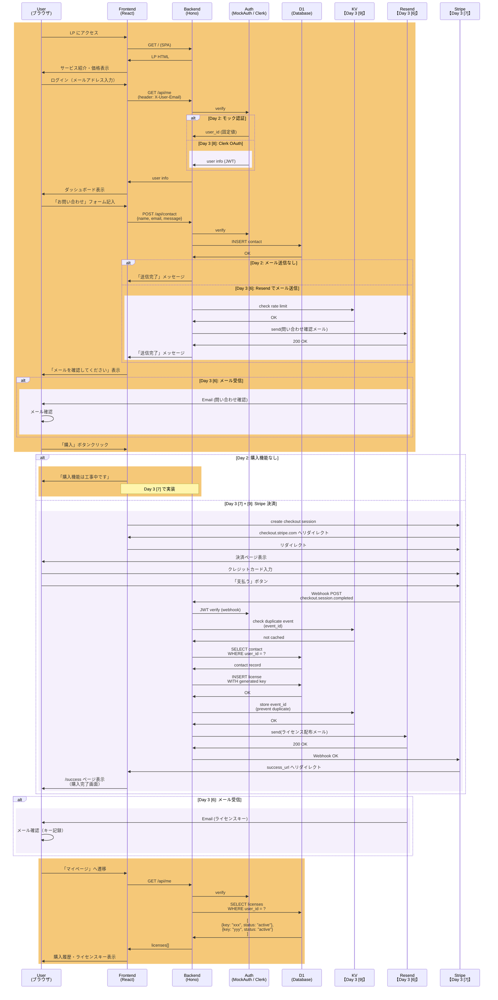

# ツール・サービス連携シーケンス図

```mermaid
sequenceDiagram
    participant User as User<br/>(ブラウザ)
    participant Frontend as Frontend<br/>(React)
    participant Backend as Backend<br/>(Hono)
    participant Auth as Auth<br/>(MockAuth / Clerk)
    participant D1 as D1<br/>(Database)
    participant KV as KV<br/>【Day 3 [9]】
    participant Resend as Resend<br/>【Day 3 [6]】
    participant Stripe as Stripe<br/>【Day 3 [7]】

    rect rgb(245, 200, 120)
    
    User->>Frontend: LP にアクセス
    Frontend->>Backend: GET / (SPA)
    Backend->>Frontend: LP HTML
    Frontend->>User: サービス紹介・価格表示

    User->>Frontend: ログイン（メールアドレス入力）
    Frontend->>Backend: GET /api/me<br/>(header: X-User-Email)
    Backend->>Auth: verify
    alt Day 2: モック認証
        Auth->>Backend: user_id (固定値)
    else Day 3 [8]: Clerk OAuth
        rect rgb(245, 240, 252)
        Auth->>Backend: user info (JWT)
        end
    end
    Backend->>Frontend: user info
    Frontend->>User: ダッシュボード表示

    User->>Frontend: 「お問い合わせ」フォーム記入
    Frontend->>Backend: POST /api/contact<br/>{name, email, message}
    Backend->>Auth: verify
    Backend->>D1: INSERT contact
    D1->>Backend: OK
    
    alt Day 2: メール送信なし
        Backend->>Frontend: 「送信完了」メッセージ
    else Day 3 [6]: Resend でメール送信
        rect rgb(245, 240, 252)
        Backend->>KV: check rate limit
        KV->>Backend: OK
        Backend->>Resend: send(問い合わせ確認メール)
        Resend->>Backend: 200 OK
        Backend->>Frontend: 「送信完了」メッセージ
        end
    end
    Frontend->>User: 「メールを確認してください」表示

    alt Day 3 [6]: メール受信
        rect rgb(245, 240, 252)
        Resend->>User: Email (問い合わせ確認)
        User->>User: メール確認
        end
    end

    User->>Frontend: 「購入」ボタンクリック
    
    end

    alt Day 2: 購入機能なし
        rect rgb(245, 200, 120)
        Frontend->>User: 「購入機能は工事中です」
        note over Frontend,Backend: Day 3 [7] で実装
        end
    else Day 3 [7] + [9]: Stripe 決済
        rect rgb(245, 240, 252)
        Frontend->>Stripe: create checkout session
        Stripe->>Frontend: checkout.stripe.com へリダイレクト
        Frontend->>Stripe: リダイレクト
        Stripe->>User: 決済ページ表示
        User->>Stripe: クレジットカード入力
        User->>Stripe: 「支払う」ボタン
        Stripe->>Backend: Webhook POST<br/>checkout.session.completed
        
        Backend->>Auth: JWT verify (webhook)
        Backend->>KV: check duplicate event<br/>(event_id)
        KV->>Backend: not cached
        
        Backend->>D1: SELECT contact<br/>WHERE user_id = ?
        D1->>Backend: contact record
        Backend->>D1: INSERT license<br/>WITH generated key
        D1->>Backend: OK
        
        Backend->>KV: store event_id<br/>(prevent duplicate)
        KV->>Backend: OK
        
        Backend->>Resend: send(ライセンス配布メール)
        Resend->>Backend: 200 OK
        Backend->>Stripe: Webhook OK
        
        Stripe->>Frontend: success_url へリダイレクト
        Frontend->>User: /success ページ表示<br/>（購入完了画面）
        end
    end

    alt Day 3 [6]: メール受信
        rect rgb(245, 240, 252)
        Resend->>User: Email (ライセンスキー)
        User->>User: メール確認（キー記録）
        end
    end

    rect rgb(245, 200, 120)

    User->>Frontend: 「マイページ」へ遷移
    Frontend->>Backend: GET /api/me
    Backend->>Auth: verify
    Backend->>D1: SELECT licenses<br/>WHERE user_id = ?
    D1->>Backend: [<br/>  {key: "xxx", status: "active"},<br/>  {key: "yyy", status: "active"}<br/>]
    Backend->>Frontend: licenses[]
    Frontend->>User: 購入履歴・ライセンスキー表示
    
    end
```
